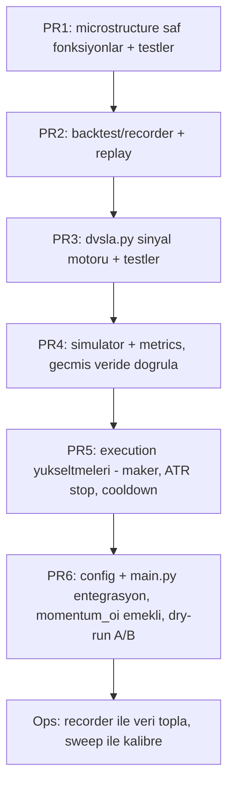

# DVSLA Geçiş Planı

> **DVSLA** = *Dynamic Volume-Synchronized Liquidity Absorption*
> Momentum-chase stratejisini emekli edip, likidasyon şelalesi sonrası ortalamaya dönüşü
> maker emirlerle sömüren istatistiksel bir stratejiye geçiş.

Kaynak: `docs/Kripto Piyasa Mikroyapısı ve Algoritmik Stratejiler.txt` (deep research) +
mevcut momentum stratejisinin kayıp loglarının teşhisi.

---

## 1. Onaylanan Kararlar

| # | Karar |
|---|-------|
| 1 | **Faz 0-Lite**: Signed-volume (trade aggressor `side`) proxy ile başla. L2 order book / gerçek VOI şimdilik YOK. |
| 2 | `src/strategy/momentum_oi.py` **tamamen emekli** edilecek. Tek odak DVSLA. |
| 3 | `backtest/recorder.py` hemen yazılıp canlıya alınacak; gerçek tick verisi birikmeye başlayacak. |
| 4 | **numpy + pandas** bağımlılıkları eklenecek (Hurst, Z-skor, rolling istatistik hızı için). |

---

## 2. Teşhis Özeti (neden mevcut strateji kaybediyor)

- Win Rate %26–32, sürekli negatif PnL, çıkışların neredeyse tamamı trailing stop (-%2 … -%6 ROE).
- **Kök neden**: taker momentum-chase — breakout zirvesinde girip fakeout / mean-reversion kurbanı oluyoruz.
- `trailing_callback 0.6%` fiyat = 10x'te ~%6 ROE; `peak_px` girişte aktif → ilk mikro geri çekilmede stop.
- EMA20 rejim filtresi gerçek 1h değil, düzensiz tick EMA'sı; çoğu zaman `neutral`'da takılı.
- Config drift: `.env` 11 sembol, çalışan instance 26 sembol + farklı eşikler.

---

## 3. Veri Feasibility (kritik kısıt)

WS feed'inde mevcut olanlar (`src/exchange/hyperliquid_ws.py`):

- **TradePayload**: `px`, `sz`, **`side` (aggressor)**, `hash`, `tid`
- **AssetCtxPayload**: `mark_px`, `open_interest`, `funding`, `oracle_px`, `day_ntl_vlm`

Mevcut OLMAYAN:

- L2 order book → `subscribe_l2` `NotImplementedError` (hyperliquid_ws.py:159)
- Liquidation feed (yok)

Sonuç:

- Gerçek VOI (L1 bid/ask) yerine **trade-flow imbalance (signed volume)** proxy:
  `I = (V_buy - V_sell) / (V_buy + V_sell) ∈ [-1, 1]`
- Likidasyon şelalesi proxy'si: OI düşüşü + fiyat sıçraması (return z-score) + tek yönlü
  signed-volume spike + `oracle_px` ↔ `mark_px` sapması.

---

## 4. Hedef Mimari

```
src/strategy/microstructure/      # Katman 1: saf, deterministik istatistik çekirdeği
    __init__.py
    volume_bars.py                # hacim mumları (zaman yerine)
    rolling_stats.py              # Welford online mean/std, z-score
    oi_zscore.py                  # OI normalizasyonu / taze para filtresi
    flow_imbalance.py             # signed-volume → VOI proxy
    hurst.py                      # Hurst üsteli (rejim tespiti)

src/strategy/dvsla.py             # Katman 2: DVSLA sinyal motoru (on_market_event arayüzü)

backtest/                         # Katman 4: ölçüm altyapısı
    __init__.py
    recorder.py                   # canlı WS event -> JSONL (data/recordings/)
    replay.py                     # JSONL -> MarketEvent geri oynatma (look-ahead yok)
    simulator.py                  # maker/taker fill + fee/slippage + pozisyon defteri
    metrics.py                    # win rate, Sharpe, max DD, profit factor, ortalama R
    sweep.py                      # parametre taraması
```

Tasarım ilkesi: strateji motoru **aynı `on_market_event(event)`** arayüzünü kullanır →
canlı kod = backtest kodu, look-ahead bias imkansız.

---

## 5. Katman 1 — microstructure (saf matematik)

| Dosya | Sorumluluk | Matematik |
|-------|-----------|-----------|
| `volume_bars.py` | Eşik hacme ulaşınca OHLCV + signed-volume mumu kapat | hacim eşiği (günlük hacmin 1/N'i) |
| `rolling_stats.py` | Online mean/std (Welford), z-score | `z = (x-μ)/σ` |
| `oi_zscore.py` | OI değişiminin rolling z-skoru | taze para = pozitif OI z + fiyat onayı |
| `flow_imbalance.py` | signed volume → imbalance | `I = (Vb-Va)/(Vb+Va)` |
| `hurst.py` | R/S veya DFA ile Hurst | `H<0.45` mean-revert, `H>0.55` trend |

Hepsi numpy tabanlı saf fonksiyon; birim testleri deterministik.

---

## 6. Katman 2 — DVSLA sinyal motoru

**Giriş (likidasyon şelalesi sonrası mean-reversion):**

1. Şelale tespiti (proxy): volume-bar getiri z-skoru `|z|>3` + OI düşüyor +
   tek yönlü signed-volume spike + oracle/mark sapması genişliyor.
2. Yön: şelalenin **tersine** (aşağı şelale → LONG, yukarı → SHORT).
3. Giriş emri: **maker limit** (likidite soğurma, taker fee'den kaçınma).
4. Rejim kapısı: yalnızca `H < 0.45` (mean-reverting) iken aktif.

**Çıkış:**

- TP: VWAP / ortalamaya dönüş (kısa vadeli).
- SL: sabit % değil → **Volume-ATR dinamik stop**.
- Time-stop: N volume-bar içinde dönüş olmazsa çık (tez geçersiz).

---

## 7. Katman 3 — Execution yükseltmeleri

| Değişiklik | Dosya | Neden |
|-----------|-------|-------|
| Maker limit emir | `src/execution/order_router.py` | likidite soğurma, fee |
| Volume-ATR dinamik stop | `src/execution/position_manager.py` | sabit %2 → volatiliteye duyarlı |
| Re-entry cooldown | order_router / position_manager | aynı tuzağa tekrar girme |
| VWAP-reversion TP | position_manager | kısa vadeli kâr realizasyonu |
| Confidence → pozisyon boyutu | order_router | confidence şu an çöpe gidiyor |

---

## 8. Katman 4 — Backtest harness

| Dosya | İş |
|-------|-----|
| `recorder.py` | canlı WS event → JSONL kaydı |
| `replay.py` | kayıtlı event → strateji motoru (sıralı, look-ahead yok) |
| `simulator.py` | maker/taker fill, slippage + fee modeli, pozisyon defteri |
| `metrics.py` | win rate, Sharpe, max DD, profit factor, ortalama R |
| `sweep.py` | grid/random parametre taraması |

İlk adım: `recorder.py`'yi canlıya koyup birkaç gün gerçek veri biriktirmek.

---

## 9. Uygulama Sırası (PR'lar)



---

## 10. PR1 — Görev Listesi (microstructure)

1. `requirements.txt` + `pyproject.toml`'a `numpy`, `pandas` ekle.
2. `src/strategy/microstructure/__init__.py`.
3. `rolling_stats.py`: `Welford` online mean/std + `z_score`.
4. `flow_imbalance.py`: `signed_volume(trade_side, sz)`, `flow_imbalance(buys, sells)`.
5. `volume_bars.py`: `VolumeBarAggregator` (eşik dolunca OHLCV + signed vol mumu).
6. `oi_zscore.py`: rolling OI değişimi z-skoru.
7. `hurst.py`: `hurst_rs(series)` (R/S) — numpy.
8. `tests/test_microstructure.py`: her fonksiyon için deterministik birim testler.

## 11. PR2 — Görev Listesi (recorder + replay)

1. `backtest/__init__.py`.
2. `backtest/recorder.py`: `EventRecorder` — `MarketEvent`'i JSONL'e serialize
   (`data/recordings/{date}.jsonl`), atomik append, rotation.
3. `src/main.py`: opsiyonel `RECORD_EVENTS` flag ile recorder'ı market fanout'a bağla.
4. `backtest/replay.py`: JSONL → `MarketEvent` deserialize, sıralı generator.
5. `tests/test_backtest_recorder.py`: round-trip (record → replay → eşitlik) testi.

---

## 12. Kısıtlar / Notlar

- Python 3.13 `.venv`: `source .venv/bin/activate && python -m pytest tests/`
- Mevcut 56 test yeşil kalmalı; yeni modüller yeni testler getirir.
- `momentum_oi.py` PR6'da emekli edilir (önce DVSLA doğrulanır, sonra geçiş).
- `b-yurt` şirket git/ssh konfigine dokunma; push `burcayyurt` PAT ile.
- Recorder verisi `data/recordings/` → `.gitignore`'a eklenmeli (`data/` zaten ignore).
